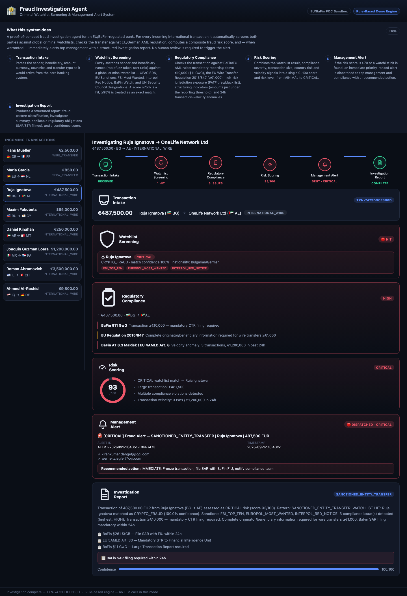

# Fraud Investigation Agent

A proof-of-concept AI fraud investigation agent for an EU/BaFin-regulated bank. For every
incoming international transaction, it automatically screens both parties against global
criminal watchlists, checks the transfer against EU/German AML regulation, computes a
composite fraud risk score, and — when warranted — immediately alerts top management with a
structured investigation report. No human review is required to trigger the alert.

Two interfaces are included:
- A **web demo** (Flask + vanilla JS) that streams the investigation pipeline live to the
  browser, stage by stage.
- A **terminal CLI** (`main.py`) for a quick, no-frills run.

Both run the same investigation engine and support two modes:
- **Demo mode** (default, no API key needed) — a deterministic, rule-based engine.
- **LLM mode** — an agentic loop where Claude calls the same tools itself, given an
  `ANTHROPIC_API_KEY`.



## How it validates a transaction

1. **Transaction Intake** — Parses the sender, beneficiary, amount, currency, countries and
   transfer type as it would arrive from the core banking system.
2. **Watchlist Screening** — Fuzzy-matches sender and beneficiary names (`rapidfuzz`
   token-sort ratio) against a global criminal watchlist — OFAC SDN, EU Sanctions, FBI Most
   Wanted, Interpol Red Notice, BaFin Watch, and UN Security Council designations. A score
   ≥75% is a hit; ≥95% is treated as an exact match.
3. **Regulatory Compliance** — Checks the transaction against BaFin/EU AML rules: mandatory
   reporting above €10,000 (§11 GwG), the EU Wire Transfer Regulation 2015/847 (≥€1,000),
   high-risk jurisdiction exposure (FATF grey/black list), structuring indicators (amounts
   just under the reporting threshold), and 24h transaction-velocity anomalies.
4. **Risk Scoring** — Combines the watchlist result, compliance severity, transaction size,
   country risk and velocity signals into a single 0–100 score and risk level, from MINIMAL
   to CRITICAL.
5. **Management Alert** — If the risk score is ≥70 or a watchlist hit is found, an immediate
   priority-ranked alert is dispatched to top management and compliance with a recommended
   action.
6. **Investigation Report** — Produces a structured report: fraud pattern classification,
   investigator summary, applicable regulatory obligations (SAR/STR filings), and a
   confidence score.

## Project layout

| File | Purpose |
|---|---|
| `fraud_agent.py` | Investigation engine — watchlist screening, compliance checks, risk scoring, alert dispatch, and the Claude tool-use agentic loop for LLM mode. |
| `config.py` | Regulatory thresholds, country risk lists, model config, alert recipients. |
| `transaction_generator.py` | Seeded demo transactions (clean + criminal-linked). |
| `criminal_watchlist.json` | Sample watchlist data (fictional POC data). |
| `alert_service.py` | Simulated management alert dispatch (console output). |
| `main.py` | Terminal CLI runner. |
| `server.py` | Flask backend serving the web demo and streaming pipeline events over SSE. |
| `web/` | Frontend (`index.html`, `style.css`, `app.js`) for the web demo. |
| `fraud_investigator_prompt.md` | Reference notes on the investigator system prompt. |

## Setup

```bash
pip install -r requirements.txt
cp .env.example .env   # optional — only needed for LLM mode
```

To use LLM mode, set `ANTHROPIC_API_KEY` in `.env`. Without it, both interfaces automatically
fall back to demo mode.

## Running the web demo

```bash
python3 server.py
```

Open `http://127.0.0.1:5057/` in a browser. Pick a transaction on the left to watch the
pipeline run live — each stage lights up as it completes, with results (watchlist hits,
compliance issues, risk gauge, alert dispatch, final report) revealed progressively.

## Running the CLI

```bash
python3 main.py
```

Select a transaction by number, `A` to run the full batch, or `Q` to quit. Each investigation
also saves a full JSON report to `reports/`.

## Regulatory frameworks referenced

- **BaFin**: GwG (AML Act), KWG (Banking Supervision Act), MaRisk, §261 StGB
- **EU**: 4/5/6AMLD, Wire Transfer Regulation 2015/847, EU Sanctions Regulation, GDPR Art. 6(1)(c)
- **International**: FATF 40 Recommendations, Wolfsberg Principles, Egmont Group FIU standards

## Disclaimer

This is a sandbox proof-of-concept. Watchlist data, thresholds, and recipient addresses are
for demonstration only and are not connected to any real screening, reporting, or alerting
system.
